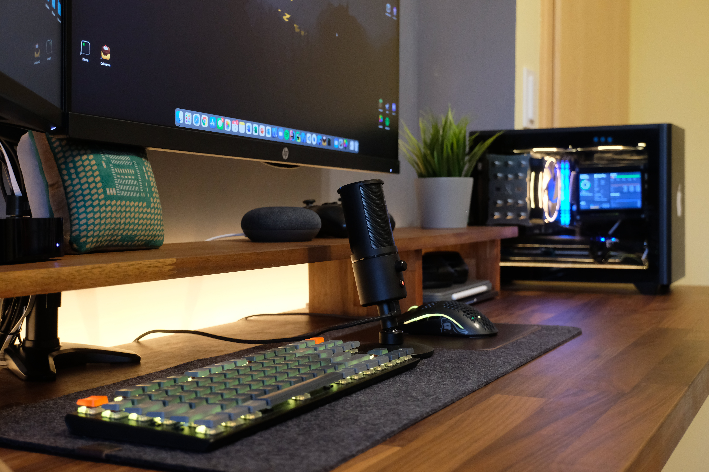

# Triple Boot MiniITX Hackintosh (MacOS Monterey, Windows 11, Ubuntu 22.04) in NR200P


Hey there,

A few months ago I started building my first Mini-ITX machine. I added some things here and there like a stats display inside the pc, (too) much RGB lights and wasted way too much time configuring the software of my Hackintosh like OpenCore, macOS in general and trying different Operating Systems. But now as 2021 has ended and I had time in the holiday season I can finally present my dream Hackintosh machine!
<!---  -->
<!---  -->

# Introduction
This isn't a full blown step by step build/installing guide of my machine. I just want to share some things about my PC that other people might find interesting or motivate them to expand their own builds. I really enjoy tweaking the hardware and software of my machine so I want to share some of my experiences with you.

## Why a Hackintosh?
Configuring a Hackintosh and especially keeping it up to date is pretty time consuming. MacOS and OpenCore updates can make the configuration unbootable and they involve quite some tinkering around to get everything working reliably. And in my case I rely on a functioning system as I use it for university and personal project so it has to work like a real mac in almost any regard. The question arises why someone would go through all the struggles of hackintoshing especially now when Apple produces their own ARM chips with very appealing performance concerning the power usage.

In my case I need a Desktop PC that combines productive work under macOS but also gaming on Windows and development under Linux. Gaming isn't really enjoyable under macOS/Apple Silicon Chips at the moment, so a Hackintosh running all 3 OSes is a perfect solution for me. I also like tinkering around and a hackintosh gives me the possibility (in comparison to Apple) to select the specific hardware I want.

For this build I wanted to go MiniITX mainly for the looks but I also like the challenge of cramping as much horsepower as possible in a small form factor case while making almost no compromises regarding performace or looks.

**Short Disclaimer:** Everything involving the Hackintosh aspect of this build is for educational purposes only and therefore just a proof of concept. Installing macOS on non Apple Devices violates Apples EULA and therefore isn't recommended, especially in a commercial environment.


# Hardware
When building a PC (especially considering a Hackintosh) the selection of hardware components is crucial in order for everything to work properly. MacOS is very restrictive with some hardware components so careful consideration is required.
## Case
The foundation of this build is the well known NR200P. It's a fantastic miniITX case: good looking, much space for components inside and a very appealing price.
## CPU
For the CPU I went with 10th Gen Intel as it is the latest generation of Intel processors that is natively and fully supported by macOS. In specific, I chose the i9-10850k (10 Cores @ 3.6 GHz, boosted up to 4.9 GHz) because it was way cheaper (in my region) than the i9-10900k and has similar performance.
## Mainboard
On the motherboard side, i wanted to buy one that has a wifi and bluetooth chip that is natevly supported by macOS. Most mini-ITX z490 motherboard that I found had a Intel wifi chip which in general aren't compatible with macOS but there were a few boards (e.g. AsRock Z490 Phantom Gaming ITX/TB3) that were at least CNVI unlocked, meaning you can change the chip manually to a Broadcom chip that is supported by macOS. For swapping the chip a bit tinkering is involved but it is doable. I linked some resources in the building section which include detailed intructions with many pictures showing how to do it properly.
## CPU Cooler
With the motherboard set, it was time to choose a cooler for the CPU. There the real struggle began. First of all I was constricted concerning the hight of the cooler because the case only supports coolers up to 153mm tall. The other constraint was the motherboard itself which has a bulky VRM top heatsink which interferes with many different cooler. After searching for a long time and only finding coolers which will definitely not fit, I just went for it and bought the Scythe Mugen 5 Rev.B.
Turns out the cooler just so slightly fits inside the case. Its a very tight fit, I filed a little bit of metal away from the heatsink just to be sure, but now there is a gap between the cooler and the heatsink (I can fit a sheet of paper between them) so I have no concernes there and the glass panel of the case also closes, its a perfect fit!
## RAM
Concerning RAM, I choose 64 GB of DDR4 3600 MHz memory divided into 2 modules. The main reason for going with 64GB was that the ram isn't expandable in the future because miniITX boards only have 2 RAM slots and both are occupied by this kit.
## GPU
For the GPU I temporarly use a custom 5700XT model. It is also natevly supported by macOS but I plan to upgrade the card to a RX 6800XT if I am able to get one of these (which is currently almost impossible in europe...).
## Other Components
The rest of the components is straight forward: A 750W PSU from Corsair, some ARGB Fans and a RGB Light Strip. I also put in a 2TB SSD from an old build of mine and purchased 2 1TB M.2 SSDs from Crucial.

|                 | **Parts**                                     |
| --------------- | --------------------------------------------- |
| **CPU**         | Intel Core i9-10850K                          |
| **Case**        | NR200P Black                                  |
| **Motherboard** | ASRock Z490 Phantom Gaming-ITX/               |
| **CPU-Cooler**  | Scythe Mugen 5 Rev.B                          |
| **RAM**         | Kingston FURY Beast 64GB (DDR4-3600 CL18)     |
| **GPU**         | XFX RX 5700XT THICC III Ultra                 |
| **PSU**         | Corsair SF Series SF750 80 PLUS Platinum 750W |
| **Storage**     | 2x Crucial P2 SSD 1TB (M.2) + old 2TB SSD     |
| **Wifi-Card**   | Fenvi BCM94360NG                              |
| **Fans**        | Cooler Master MasterFan MF120 Halo (3-pack)   |
| **LED-Strip**   | 0.55m LED Light Strip (no-name brand)         |

# Building process


The building process in most regards was straight forward and the same as any other miniITX build. The NR200 has plenty of space for an miniITX case so it is in general pretty easy to build in. But regarding the mainboard I had some serious problems.

First of all, I needed to replace the Wifi/Bluetooth Card with one that is supported by macOS. In order to do this, you have to remove the glue underneath the plastic cover of the motherboard, remove some screws and then bend the IO shield in order to remove it. This part drove me crazy, It wasn't easy to get it off and then afterward get it back on again without breaking anything. There is a good documented guide [here](https://docs.google.com/document/d/1XeUu0YcV2JjsxzpEYQL7mAyqkdN7Q0TTLC6gSsfxzC4/edit) which shows how to do it.


In the next step I installed both m.2 SSDs, the CPU and then the cooler. Another problem with this mainboard occured regarding the cooler clearance. Because of the bulky top VRM heatsink of the mainboard many coolers don't fit on this board. The cooler I selected just so slightly fitted when I filed some metal from it away. With the help of this little fix, everything now fits on the board and when I first saw it all assembled together I was quite impressed how small the board really is even when everything is mounted on top of it.


The rest of the build luckily went without any further problems. I screwed the PSU in the case, routed the cables to their location, put in the mainboard and then plug the GPU in. Then it was time for the case fans and the LED-Strip at the bottom of the case. Routing the cable, especially of the case fans was a bit of a challenge because there were so many cables with the fan splitters and RGB cables but in the end, everything fitted well.

In the last step I installed another SSD and plug the rest of the cables in.

# OS Installation

## Installing MacOS, Windows and Ubuntu: OS Considerations

This part is where most of my time went with this build. I carefully selected the components in order for them to work with macOS because macOS is very specific with some hardware components. But I also wanted to use this machine for Gaming, and my University stuff as well as personal projects.


Therefore I planed to triple-boot this machine, meaning I install 3 different OSes, in my case: MacOS Monterey for university/work, Windows 11 for gaming and Linux (Ubuntu in my case) for personal projects and development.

In general, installing macOS on non Apple Devices these days is easier than ever. OpenCore is a blessing to work with (especially Dorthanias installation guide is very usefull) and I was lucky because [@schmocklord](https://github.com/SchmockLord/) created a very similar build with the same motherboard and a similar CPU so his config files were a good reference for me. Currently I am running macOS 12.3.1 on my machine.


## Secure Boot requirement


In my case there were a bit more steps involved in the installation process. I wanted to use Windows 11 because I really like how it evolved from Windows 10. Finally Windows has a dedicated Package Manager for Software, WSL (Linux running as a subsystem within Windows) gets support for graphical applications, Android apps can be installed and run with ease and in general I really like the new design philosophy. But with Windows 11 Microsoft enforces to use secure boot in order to use Windows 11. There are ways to bypass this, but it is not clear whether updates are being enrolled in the future to devices which bypass this security feature and I also wanted to configure it properly in general so secure boot is a requirement. All modern motherboards support this feature but also every OS you install on such a machine is forced to support this feature. Ubuntu is one of a few Linux distrubutions which support secure boot by default but with macOS there is a bit more work involved for setting it up correctly.

## Installation Overview
In general I would recommend to first install Windows, than Linux (Windows can mess with the grub bootloader which most Linux distros use) and macOS with OpenCore in the end. After all 3 OSes are able to be booted via OpenCore, I finalized my OpenCore configuration and then started enabling secure boot (because tinkering with the bootloader when secure boot is enabled can be frustrating).

## Configuring OpenCore in Detail
For everything involving OpenCore, I mainly used [Dortania's OpenCore Install Guide](https://dortania.github.io/OpenCore-Install-Guide/).
My OpenCore configruation is mainly based on an [existing configuration]((https://github.com/SchmockLord/Hackintosh-Intel-i9-10900k-AsRock-Z490-Phantom-ITX-TB3)) from [@schmocklord](https://github.com/SchmockLord) since he used very similar hardware components. In his github repo he has explained the main steps that have to be done in order to get macOS running. I started with his configuration with no modifications at all but a few things didn't work for me so I had to change some things around.

First of all USB didn't work for me (No USB-3 devices were detected) so I created a custom USB kext by mapping my usb ports manually. This also fixed the issue of sleep mode not working for me. My USB-Map ended up looking like this (visualized using Hackintool):


When I sent my machine to sleep before, it instantly woke up again which is a common issue when not properly mapping the USB ports in macOS but after applying the correct USB map everything worked. I also updated all the OpenCore Drivers, OpenCore.efi and changed the config.plist respectively (OC 0.7.6). Dorthania also has a section in the guide covering [how to update OpenCore](https://dortania.github.io/OpenCore-Post-Install/universal/update.html) properly.

After setting up this base opencore config, I wanted to customize it a bit and therefore changed the icons within OpenCore for the different OS boot drives and also added some drivers like OpenShell and a Screenshot Tool. My finalized OpenCore Boot menu ended up looking like this:


You can see that I can boot Windows and Linux within the opencore menu. Windows was detected right out of the box but linux couldn't be booted directly so I had to add the drivers called OpenLinuxBoot.efi as well as ext4_x64.efi. How this is done specificly is also described in the [corresponding section](https://dortania.github.io/OpenCore-Multiboot/oc/linux.html) of the OpenCore guide.

At this point everything worked as I wanted it to be but one challenged remained: For Windows 11 secure boot needs to be configured so I had to enable this in macOS as well. For this, I followed the guide from [@schmocklord](https://github.com/SchmockLord) as well as the [corresponding section](https://dortania.github.io/OpenCore-Post-Install/universal/security/applesecureboot.html) in  the OpenCore documentation.
After setting everything up you can verify that secure boot in macOS works by executing the command:
```bash
nvram 94b73556-2197-4702-82a8-3e1337dafbfb:AppleSecureBootPolicy
```
which should give the following oputput. %02 indicates that full security is enabled.

```bash
94b73556-2197-4702-82a8-3e1337dafbfb:AppleSecureBootPolicy	%02
```
Secure boot now works in macOS as well but now Linux isn't bootable via OpenCore anymore because I use the OpenBootLinux.efi driver for booting it and the BIOS doesn't know this driver so it refuses to boot it. For this to work, there is a small section in the OpenCore Manual explaining this. There is also a [forum post](https://www.insanelymac.com/forum/topic/349317-opencore-shim-to-certtool/) and a good [reddit post](https://www.reddit.com/r/hackintosh/comments/rbe4li/openlinuxbootext4_x64_isnt_signed_with_custom/) explaining how to do it.

A short summary of what to do: First boot into Linux. Make a directory where we put all necessary files.
```bash
$ mkdir ~/Certs
```
In the next step you need to copy the grub shim file as well as the Shim-to-cert-Tool from your Opencore Folder
```bash
$ sudo cp /boot/efi/EFI/ubuntu/shimx64.efi ~/Certs/
$ cp OPENCORE_FOLDER/Utilities/ShimToCert/shim-to-cert.tool ~/Certs/
```
Go into the folder and execute the cert-to-shim-tool.
```bash
$ cd ~/Certs/
$ chmod +X shim-to-cert.tool
$ sudo ./shim-to-cert.tool shimx64.efi
```
If run correctly, your terminal should output something like this:
```bash
Secure Boot block list found and saved as vendor.dbx.
Certificate extracted as CanonicalLtd.MasterCertificateAuthority.pem.
```
vendor.dbx is a blocklist and not necassary but can increase the secutirty of secure boot while CanonicalLtd is needed for Ubuntu to be bootable from OpenCore. 
In my case, I could just add the vendor.dbx file within my BIOS secure boot key manager. CanonicalLtd.MasterCertificateAuthority.pem however couldn't be added directly to my BIOS because the format isn't supported so I had to convert it to another file type. For this I installed efitools.
```bash
$ sudo apt install efitools
$ cert-to-efi-sig-list CanonicalLtd.MasterCertificateAuthority.pem UbuntuOpenCoreKey.esl
```
The resulting output file UbuntuOpenCoreKey.esl can then be added to the BIOS Secure Boot Key manager. Now booting Ubuntu from OpenCore should work with secure boot enabled.


Thats all there is about OpenCore and the macOS installation in general. I have the system running for a couple of months and for now, it runs perfectly fine. Updates also ran flawless when updating OpenCore properly before. I haven't had any kernel panics or other kind of crashes and the system in general runs buttery smooth and isn't distinguishable from a real mac in any regards. It handles heavy workloads without any issues and even gaming is possible (as far as macOS supports it, or just by booting into windows).

The only thing that bothers me is that DRM protected content (4K Netflix, Amazon Prime, AppleTV etc.) isn't playable.

There is a short explanation about this over [here](https://github.com/acidanthera/WhateverGreen/blob/master/Manual/FAQ.Chart.md). The problem is the choosen SMBIOS. I went for the iMac20,2 as it replicates my system specification as close as possible and also enables the integrated intel graphics chip from my CPU which enables features like SideCar. But unfortunately, DRM protected content only works in macOS when only an AMD gaphics card is exposed to the OS. This can be done with another SMBIOS like the iMacPro1,1 but then SideCar isn't working anymore because of the lack of the internal Intel integrated graphics. I haven't found a solution for this, so for now I have to choose if I either want to use SideCar or watch DRM protected content. For now I went with SideCar because I can boot into Windows or Linux to watch Netflix/Prime Video.


# Software tweaks

## Configuring the status display


Even if many may argue it is completely unneccessary (and I can't blame them), I wanted to have a status display inside my PC. I just like the looks of it and I think it's convenient to have all relevent system informations like CPU and GPU usage right at a glance. I also like to push the limits of miniITX cases and what I can put into them so it was an absolute natural decision to put a screen at the only location inside the PC where some space is still left!

The good thing with the NR200P as it is an very popular miniITX case: I am not the first one having this idea so there are plenty of existing builds with displays in it. Many of them just put a display in the case, route the HDMI cable from the screen out of the PC into the HDMI port of their GPU and use software which displays information to this screen. I don't really like this approach because I don't think routing cables out of a pc looks that good and the OS sees the Screen as a normal display. This causes issues of accidentally dragging programms to the small screen, the mouse getting stuck... And because I triple boot I need to configure programms which launch explicitly on the screen for every OS which I dont even know if this is possible on macOS for example.

Therefore I went with the approach that the display isn't controlled by the PC directly but rather by another device in my case a Raspberry Pi Zero 2W which eleminated all problems mentioned before. The display is connected to the Pi directly via HDMI and the display and Pi are both connected to power via an USB to MOLEX connector. MOLEX power is provided by the PSU which also adds the benefit of the Pi and the display being shut down as soon as I turn off my PC or put it to sleep mode.

After deciding which components to buy, I had to find a way to mount them inside my case. Therefore I constructed a frame around the display which holds the Pi in the back and also has three long screws to mount the construction to the case.


The screws can be put inside the holes of the PSU cage so the display is easily un-/mountable in case something has to be changed. There are many other posts over on reddit which have some creative mounting solutions as well, I would consider my method rather uncommon, but it works. The dispaly and the pi are held in place securely and they can be easily unmounted.


The last question that remains is what software should be installed on the pi to drive the display. Here I went for a custom OS from the guys over at [ModBros](https://www.mod-bros.com). It has a dedicated Windows app which collects all neccessary data that is then sent to the pi over the local network. The Pi Zero 2W supports wifi so no extra cable is neccessary for this step.


It also has the possibility to show any webcontent on the screen when I boot into another OS like macOS or Linux. This isn't supported that well natively but there is a very [good post](https://www.mod-bros.com/en/forum/t/mobro-on-a-mac-or-hackintosh-if-you-prefer~2191) over in their forum by a user who shows how to configure this.

On macOS I use iStatistica Pro which offers a web interface which looks beautiful on a status display inside the PC. In the settings of the app, this remote access can be enabled.


There are a bit more steps involved than this. I use a custom version of their webview which can be configured in an html file, more infos about this in the linked forum post. But after configuring everything right, it looks quite nice.


On linux there are also many tools which can be used to display a status screen on a webpage, but I haven't had the time yet to configure one, this is on my TODO list for now.

Overall I am pretty happy how it turned out. If I add up the cost of every component (display, Pi, Adapters, Cables,...), we are looking at roughly 80 € which is a very reasonable price in my opinion.


## Configuring Case RGB lights
In my NR200P case like mentioned earlier, there are 2 RGB ram modules, 3 ARGB fans and 1 ARGB light strip which are all connected directly to the motherboard. Normally your Mainboard manufactorer (in my case AsRock) provides you with the necessary software to controll them. However the software from AsRock just straight out doesn't work. I tried installing it multiple times but everytime either the installer or my whole system (!) crashes. I also want to be able to controll my lights in the other two OSes but the software is just available for Windows. You can in theory install the software within a virtual machine in the other OSes to control the lights but I think this is a little to much for simple light control.

Because of this issues I went with the cross platform software called [OpenRGB](https://openrgb.org) which enables to control my lights on every OS. Even though macOS is supportet, the RGB of the RAM can't be changed. This is due to some limitations in macOS but at least I am able to change the lights of the fans. In Linux, it is necessary to build a custom kernel in order to change the colors of the RAM modules. I haven't done this so far but maybe at some time in the future I will be going down this rabbit hole.


Another thing I want to add regarding RGB is to sync the lights of my PC with Phillips Hue. I have a Hue ambient light strip behind my monitors and at the edge of my desk and with the help of the Hue app for windows and macOS I am able to sync the contents of my monitor with the lights strips which has a very pleasing effect in my opinion.

As far as I know OpenRGB doesn't support syncing the lights of the PC within the Phillips Hue app so for now this is on my ToDo list. But integrating Phillips Hue lights into OpenRGB is possible and I also found a promising Python script which might offer the possibility of syncing the lights to the contents of the monitor but doing this in realtime could be a problem so I need to look into this deeper at some point in the future.


## Waking machine via smartphone (Wake On Lan)

This is a ToDo for now, haven't had enough time for enabling/setting it up yet. But I found a [promising reddit post](https://www.reddit.com/r/shortcuts/comments/rvly3o/ios_shortcut_to_enable_wan_wakeonlan/) which I will check out at some time.

# Final conclusion

As you can see, it was quite a hustle setting up this machine and configuring the whole software for it. I was very restricted in the hardware selection, the cooler almost didn't fit in the case as well as interfered with mainboard components, I needed to change the wifi/bluetooth chip which was very frustrating to change, CPU and GPU restrictions...
On the software side I needed to enable Secure Boot, setting up OpenCore with every Feature like handoff, sleep mode,... which was also pretty time involving. But in the end I now have a small but quite powerfull miniITX hackintosh machine on my desk which looks (in my opinion) very decent. It is a powerfull machine for getting work done when booting macOS and offering every feature a real mac has to offer while being much faster than most macs Apple sells. It is a awesome gaming machine when booting into Windows 11 and also development work can be done effeciently when using Linux.

<!---   -->

I am very happy how this build turned out and it will be my daily driver for the next couple of years. I hope you found this topic as interesting as I did and you might gathered some insipration for your own builds.

Much fun with building and configuring your machines! :coffee:
# Credits
- huge thank to [@schmocklord](https://github.com/SchmockLord) for his excellent [z490 mini-ITX Hackintosh build](https://github.com/SchmockLord/Hackintosh-Intel-i9-10900k-AsRock-Z490-Phantom-ITX-TB3) guide as well as his [secure boot tutorial](https://www.youtube.com/watch?v=c8JcuIQu9XY&t=585s)
- another huge thanks to the [german hackintosh forum](https://www.hackintosh-forum.de) as well as [tonymacx86](https://www.tonymacx86.com). They are an awesome resource for questions about anything concerning hackintoshing
- [Dortania's OpenCore Install Guide](https://dortania.github.io/OpenCore-Install-Guide/)
- [Opencore Project](https://github.com/acidanthera/OpenCorePkg) in general
- [OpenRGB](https://openrgb.org) and the corresponding [GitLab Page](https://gitlab.com/CalcProgrammer1/OpenRGB)
- [ModBros](https://www.mod-bros.com/de) for their awesome Rasperrry Pi Image for the status display
