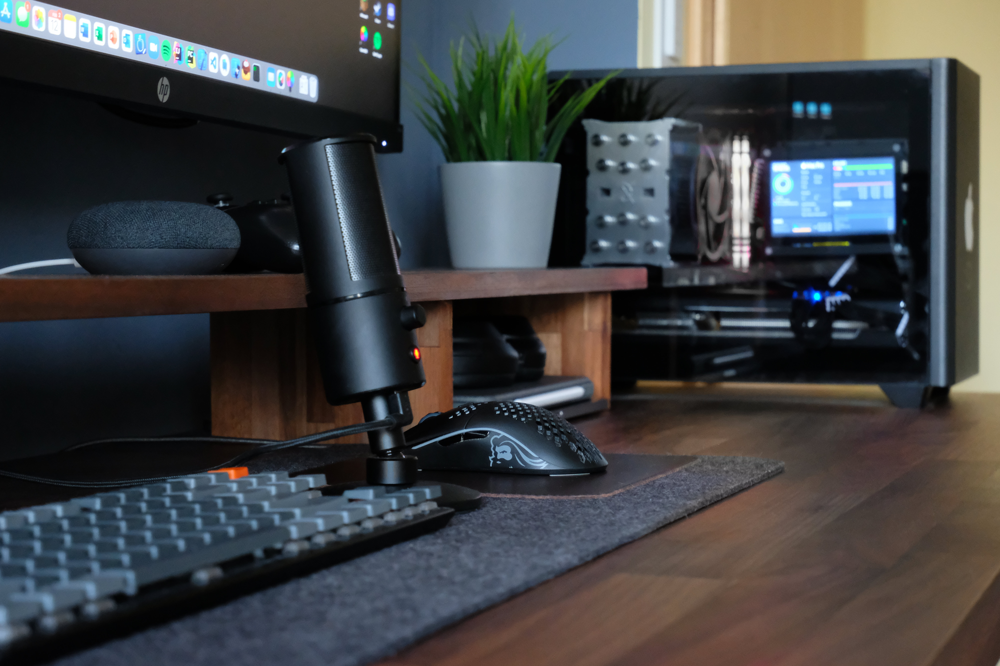

# My new desk space

Part List:

| Desk Equipment         | **Parts**                                                         |
| ---------------------- | ----------------------------------------------------------------- |
| **Desk Top**           | Ikea Karlby Walnut                                                |
| **Desk Shelf**         | DIY, just a nice looking wooden plate cut and put together        |
| **Mouse Pad**          | Pack & Smooch Large Desk Mat Mouse Mat 74 x 30 cm                 |
| **Keyboard**           | Keychron K1 v4                                                    |
| **Mouse**              | Glorious Model O Wireless                                         |
| **Controller**         | Switch Pro Controller                                             |
| **Monitor Mount**      | HUANUO 13-32 Inch Monitor Bracket                                 |
| **Main Monitor**       | HP X34                                                            |
| **Second Monitor**     | DELL S2721DGFA                                                    |
| **Microphone**         | Razer Seiren X                                                    |
| **Headphones**         | Cable: Old Sennheiser Ones (HD 558), Wireless: Sony WH1000XM3     |
| **Webcam**             | Cheap Logitech One                                                |
| **AMP/DAC**            | AIYIMA DAC-A2                                                     |
| **Smart Speaker**      | Google Nest Mini                                                  |
| **Pillow**             | LTT CPU Pillow                                                    |
| **Plant**              | Plastic Plant from Ikea                                           |
| **PC**                 | CPU: i9-10850k, GPU: RX5700XT, RAM: 64GB (used as Hackintosh)     |

| PC (Hackintosh) | **Parts**                                     |
| --------------- | --------------------------------------------- |
| **CPU**         | Intel Core i9-10850K                          |
| **Case**        | NR200P Black                                  |
| **Motherboard** | ASRock Z490 Phantom Gaming-ITX/               |
| **CPU-Cooler**  | Scythe Mugen 5 Rev.B                          |
| **RAM**         | Kingston FURY Beast 64GB (DDR4-3600 CL18)     |
| **GPU**         | XFX RX 5700XT THICC III Ultra                 |
| **PSU**         | Corsair SF Series SF750 80 PLUS Platinum 750W |
| **Storage**     | 2x Crucial P2 SSD 1TB (M.2) + old 2TB SSD     |
| **Wifi-Card**   | Fenvi BCM94360NG                              |
| **Fans**        | Cooler Master MasterFan MF120 Halo (3-pack)   |
| **LED-Strip**   | 0.55m LED Light Strip (no-name brand)         |